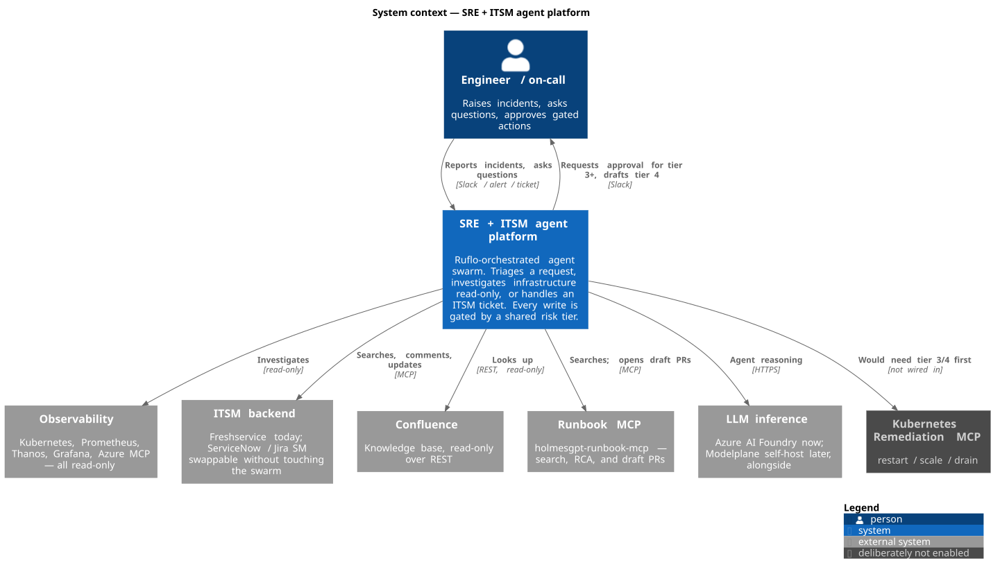
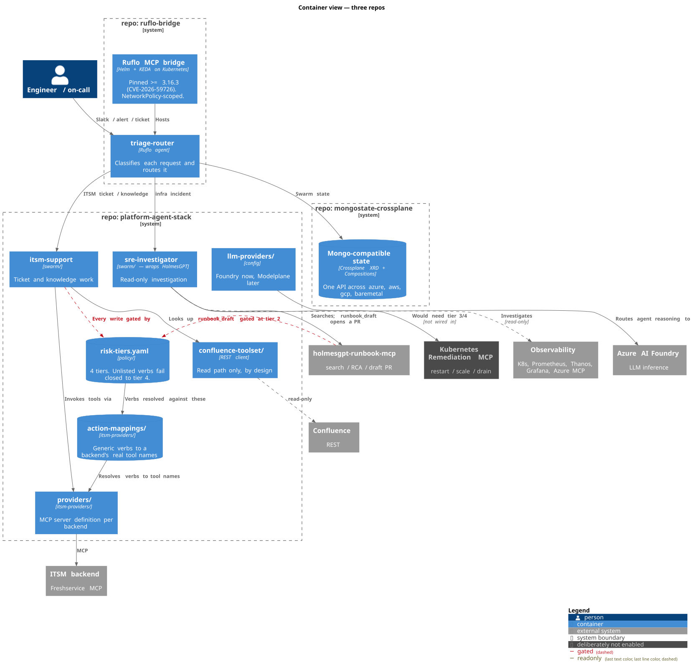

<p align="center">
  
</p>

# platform-agent-stack

Agent topology, risk policy and the pluggable backends — in one repo.

## Layout

```
platform-agent-stack/
├── swarm/                 swarm.config.json — agents and wiring
├── policy/                risk-tiers.yaml — 4 tiers, unlisted fails closed
├── itsm-providers/
│   ├── providers/         <name>.mcp.json — the MCP server definition
│   └── action-mappings/   <name>.yaml — generic verbs to real tool names
├── llm-providers/         Foundry now, Modelplane later
├── confluence-toolset/    read-only REST, no MCP required
├── docs/diagrams/         C4 model — .puml source + committed SVG
├── stack.yaml
└── setup.sh
```

## Architecture

C4 model. Source is `docs/diagrams/*.puml` (C4-PlantUML, vendored so it
renders offline); the SVGs are committed because GitHub cannot render
PlantUML in markdown. Edit the `.puml`, run `./docs/diagrams/render.sh`,
commit both — CI fails if they drift apart.

### Level 1 — system context



### Level 2 — containers

Boundaries are git repos. Everything inside `platform-agent-stack` is a
directory within it.



## Running it

```sh
ITSM_PROVIDER=freshservice ./setup.sh
```

There are no env vars to export afterwards. `swarm/swarm.config.json`
resolves policy and mappings by relative path inside this repo.

`setup.sh` clones `ruflo-bridge` next to this repo if it isn't already
there (override with `BASE_DIR`).

## Ruflo version

`setup.sh` pins `RUFLO_VERSION` (default `3.30.2`) and refuses to run
below `3.16.3`. Versions before that ship a docker-compose default which
exposes the MCP bridge's `POST /mcp` endpoints unauthenticated —
CVE-2026-59726 ("RufRoot", CVSS 10.0): unauthenticated RCE in the bridge
container, provider API key theft, and AgentDB memory poisoning.
Advisory GHSA-c4hm-4h84-2cf3.

The patch closes the *default* exposure. It does not authenticate a
bridge endpoint you publish on purpose — the NetworkPolicy check is
still yours to do.

## The stack

| Repo | Owns |
|---|---|
| [`platform-agent-stack`](https://github.com/polarpoint-io/platform-agent-stack) | Agent topology, risk policy, pluggable ITSM/LLM/Confluence backends |
| [`ruflo-bridge`](https://github.com/polarpoint-io/ruflo-bridge) | K8s + Helm + KEDA runtime for the Ruflo MCP bridge |
| [`mongostate-crossplane`](https://github.com/polarpoint-io/mongostate-crossplane) | Portable Mongo-compatible state across four platforms |
| [`holmesgpt-runbook-mcp`](https://github.com/polarpoint-io/holmesgpt-runbook-mcp) | Pre-existing — runbook search, RCA and drafting |
