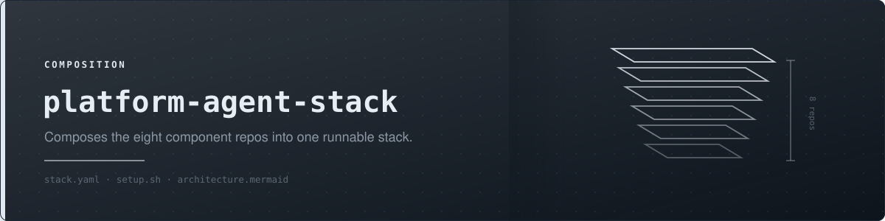
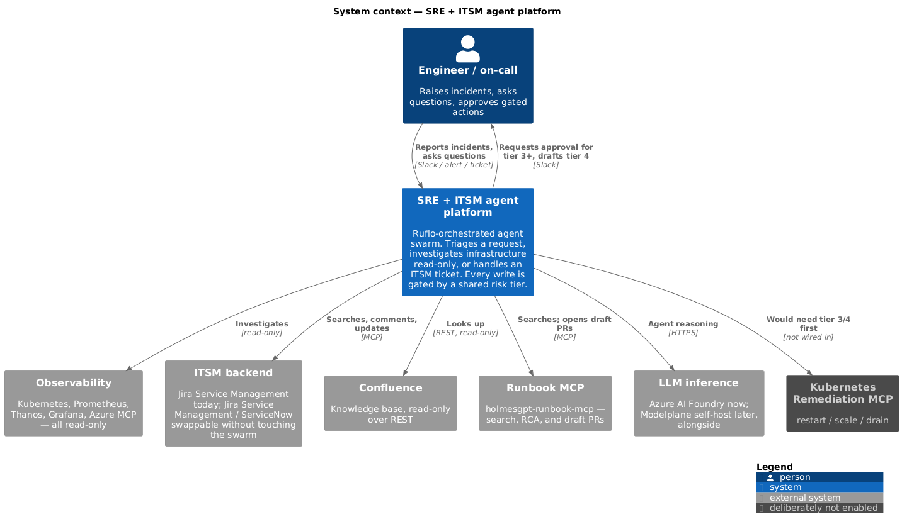
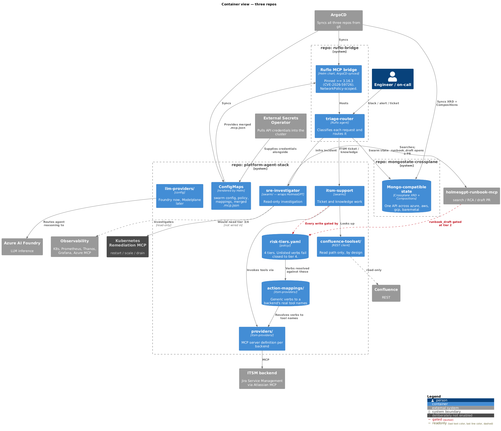
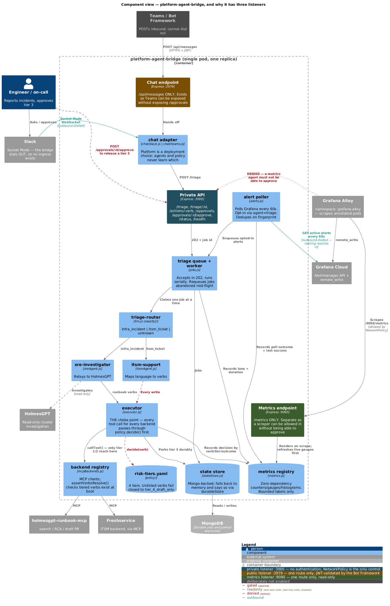
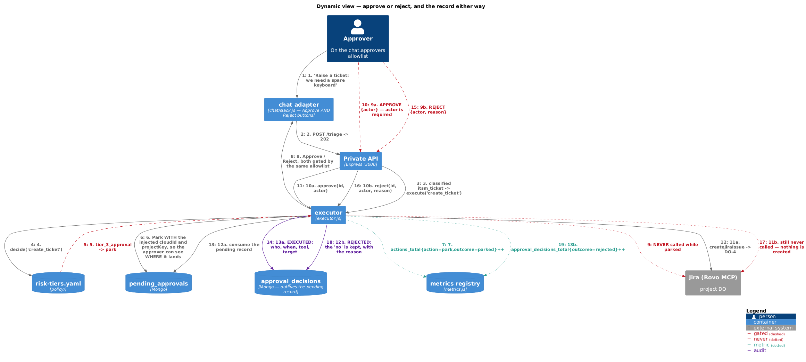
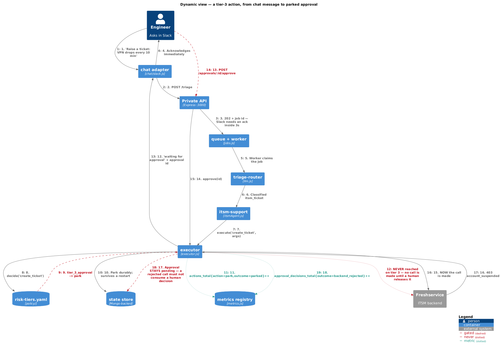

<p align="center">
  
</p>

# platform-agent-stack

Agent topology, risk policy and the pluggable backends — in one repo,
fronted by a custom MCP bridge that enforces the policy.

## Layout

The Helm chart lives under `charts/platform-agent-stack/` — `Chart.yaml`
sits there (not at repo root) so the templates can read the config
directories directly with `.Files.Get`, and so the chart is cleanly
separate from `bridge/`, the service it deploys. ArgoCD points at
`path: charts/platform-agent-stack`.

```
platform-agent-stack/
├── bridge/                  the MCP bridge itself — see bridge/README.md
│   ├── src/                 Express + @modelcontextprotocol/sdk
│   └── Dockerfile           builds ghcr.io/polarpoint-io/platform-agent-bridge
├── charts/platform-agent-stack/
│   ├── Chart.yaml
│   ├── values.yaml
│   ├── templates/          ConfigMaps, ExternalSecrets, Deployment, Services, NetworkPolicy
│   ├── swarm/               swarm.config.json — agents and wiring
│   ├── policy/               risk-tiers.yaml — 4 tiers, unlisted fails closed
│   ├── itsm-providers/
│   │   ├── providers/        jira-service-management.mcp.json — the MCP server
│   │   └── action-mappings/  jira-service-management.yaml — verbs to tool names
│   ├── llm-providers/        anthropic.yaml — the LLM backend the bridge calls
│   ├── mcp/base.mcp.json     base MCP servers, merged with the provider at render
│   └── scripts/               config validation, run in CI
├── slack-app-manifest.yaml  paste at api.slack.com to create the Slack app
├── confluence-toolset/    read-only REST, no MCP required (not yet implemented)
├── docs/diagrams/         C4 model — .puml source
└── images/external/       rendered PNGs, committed by CI
```

## Architecture

### Level 1 — system context



### Level 2 — containers

Boundaries are git repos. Everything inside `platform-agent-stack` is a
directory within it.



### Level 3 — components inside the bridge

Organised around the three listeners, because the listener split *is* the
security boundary. Everything on `:3000` is unauthenticated, so anything that
has to be reachable from somewhere else gets its own port and its own
NetworkPolicy rule — Teams on `:3979`, metrics on `:9090`.



### Dynamic — how a tier-3 action ends

Three endings, two diagrams, both traced from real runs. Keep both: the second
documents a failure mode the first doesn't show.

**Approved or rejected** — a human decides, and either decision is recorded
against their name. Traced against Jira: two identical requests parked, one
released (created `DO-4`) and one declined (nothing created).



**Approved, then refused by the backend** — the human said yes and Freshservice
returned `403 account_suspended`. The approval **stays pending** rather than
being consumed, because a backend refusal must not spend a human decision.



## Alert intake — poll, push, or both

| | Polling | Webhook |
|---|---|---|
| Direction | Dials **out** to Grafana | Grafana POSTs **in** |
| Exposure | None | Public authenticated endpoint |
| Latency | Up to `pollSeconds` | Immediate |
| Replicas | Needs a leader lease | None — the Service picks one |
| Use when | Grafana can't reach you; tailnet-only estates | You can expose one route and want lower latency |

Both may run at once. They share the fingerprint dedupe, so the same firing
arriving by both paths still produces one triage job.

The webhook mounts on the **public** listener next to the Teams route, never on
the main port, and fails closed — with no `ALERTS_WEBHOOK_TOKEN` it isn't
mounted at all, because an unauthenticated public route that enqueues LLM work
and raises tickets is an open invitation. In Grafana: *Alerting → Contact points
→ Webhook*, pointed at the `-endpoint` Service with an `Authorization: Bearer
<token>` header.

## Knowledge lookup

Runbooks come from **`holmesgpt-runbook-mcp`**, not from the ITSM backend.
It reads the Confluence space directly and returns structured runbooks —
service, failure mode, alert name, severity, MTTR, owner — rather than raw pages
for a CQL string. That structure is what an agent triaging an incident needs.

```
runbook_search {}  ->  found 1
  "RB - payments-api OOMKill"   service=payments-api  failure_mode=OOMKill
  severity=P1-P2  mttr=15m      spaces/RAID/pages/372179108
```

So the ITSM mapping deliberately leaves `list_kb_articles`, `search_confluence`
and `get_confluence_page` unmapped. Mapping them would give the model two ways
to ask the same question — one of them worse — and would require Confluence
scopes on the ITSM credential for no gain. **The ITSM backend's job is tickets.**

## Approvals

A parked tier-3 action has three possible ends, and all three are recorded.

| | |
|---|---|
| `POST /approvals/:id/approve` | Executes it. |
| `POST /approvals/:id/reject` | Declines it. The backend is never called. |
| `GET /approvals/decisions` | The audit trail — executed, rejected and backend_rejected alike. |

**Rejecting exists because "no" is a decision.** Until it did, the only way to
clear an action nobody wanted was deleting it out of MongoDB, which left no
record that a human had considered it and declined — indistinguishable from a
lost record. In Slack, Reject sits beside Approve: the confirm dialog's "Cancel"
only dismisses the prompt and leaves the action parked, which is how a queue
fills with decisions nobody made. Both buttons are gated by the same approver
allowlist, since letting anyone clear another team's action is a denial of
service on the queue.

**An actor is required on both paths**, and its strength is recorded honestly.
A shared bearer token authorises the call but cannot prove who sent it, so an
HTTP actor is stored with `actorVerified: false`; a Slack identity the platform
validated is stored `true`. Real per-person attribution needs OIDC — recording a
weak name honestly labelled beats recording nothing.

**Parked actions show their real target.** Injected deployment facts (`cloudId`,
`projectKey`) are applied at call time, so a parked record used to show them as
`undefined` — a human was asked to approve "create a ticket" without being told
which project, or which Atlassian site. They are now shown at park time too.
Preview only: `callTool` injects again regardless, so a config change between
park and approve cannot be staged by a stale record.

## Security

`POST /approvals/:id/approve` and `POST /actions/:verb` require a bearer token
from External Secrets, compared in constant time. Both are guarded — the second
takes a verb by name and skips classification, which is the sharper edge.

**Fails closed.** With no `APPROVAL_TOKEN` the routes return `503` and refuse
everything, matching how an empty `approvers` list means nobody. The secret is
marked `optional` in `envFrom` on purpose: an unseeded credential should disable
the feature it guards, not leave the pod in `CreateContainerConfigError` with
triage, chat and investigation down as collateral.

Chat approvals are unaffected — the adapters hold the executor in-process and
never traverse HTTP, so they stay gated by `chat.approvers`.

## Scaling

`replicaCount` is safe above 1. Triage jobs are claimed with a single atomic
`findOneAndUpdate`, so two replicas cannot take the same job. The alert poller
is the exception and is leader-elected via a Mongo lease — without it, every
replica polls and races to enqueue the same firing, turning one alert into N
tickets.

**Requires durable state.** With `MONGO_URI` unset the store degrades to
in-memory and each replica gets its own queue, its own approvals and its own
belief that it leads. Check `/status` reports `durableState: true` first.

## Metrics

Prometheus exposition on `:9090/metrics`, on its own listener with nothing else
mounted on it. Same argument as the Teams endpoint: a scraper has to reach this
pod, and the main port carries `POST /approvals/:id/approve` with no
credentials in front of it — so opening `:3000` to the monitoring namespace
would let anything running there release a parked tier-3 action.

Alloy scrapes pods that ask to be. `prometheus.io/port` is not optional here:
`discovery.kubernetes` makes a target per container port, and only one of this
pod's ports serves `/metrics`.

The series worth alerting on:

| Metric | Why |
|--------|-----|
| `platform_agent_backend_ready{backend}` | A backend that dropped out makes its verbs silently unavailable |
| `platform_agent_alert_last_success_timestamp_seconds` | Staleness is a positive signal; `polls_total` going flat is only an absence |
| `platform_agent_state_durable` | 0 means parked approvals and queued jobs no longer survive a restart |
| `platform_agent_approvals_pending` | Climbing means humans have stopped answering |
| `platform_agent_actions_total{verb,tier,action,outcome}` | The audit series — what was executed, parked, drafted or refused |
| `platform_agent_triage_duration_seconds{lane}` | The infra lane runs 30–60s; a change here is the first sign of trouble |
| `platform_agent_event_loop_lag_seconds` | The worker is serial, so a wedged job shows as lag before it shows as failure |
| `platform_agent_leader{lease}` | Should sum to exactly 1 across replicas. 0 means nothing is polling; above 1 is split brain |
| `platform_agent_auth_refusals_total{reason}` | `not_configured` is your own misconfiguration; `bad_token` is someone else |

Every label is bounded — verbs come from `risk-tiers.yaml`, backends from
`.mcp.json`, lanes are a closed set. Nothing is labelled with a job or ticket
id, which is how a metrics endpoint turns into an unbounded cardinality bill.

## Deploying

ArgoCD owns this. The Application is declared in `argocd-core`'s environment
values file — `<env>-aoa-values.yaml`, under the `tooling` project's
`applications:` list — and rendered by the `argocd-app-of-apps` chart.

Credentials come from External Secrets Operator. The chart names the
remote keys; it never holds a value. Set `externalSecrets.secretStoreRef`
to your real `ClusterSecretStore` before the first sync.

To render locally without a cluster:

```sh
helm template pas charts/platform-agent-stack --values charts/platform-agent-stack/values.yaml
./charts/platform-agent-stack/scripts/validate-config.sh
```

The chart refuses to render if `itsmProvider` has no provider file, a provider
file but no action mapping, `image.tag` isn't a plain semver, or
`networkPolicy.enabled=false`/`service.type` isn't `ClusterIP`. Those last two
are not fussiness: the bridge authenticates nothing, so the NetworkPolicy is the
entire access control.

Bumping the bridge is a two-part change. CI tags the image from
`bridge/package.json`'s `version`, so a code change without a version bump
overwrites the existing tag in place — and with `pullPolicy: IfNotPresent` the
nodes keep the cached layer. Bump that version **and** `image.tag` in the chart
together.

## Swapping the ITSM backend

`itsmProvider` selects the backend. Jira Service Management and
Freshservice are both implemented. Adding another is two files and no
code:

```
charts/platform-agent-stack/itsm-providers/providers/<name>.mcp.json        the MCP server definition
charts/platform-agent-stack/itsm-providers/action-mappings/<name>.yaml      generic verbs to its tool names
```

then set `itsmProvider: <name>`. Neither `swarm/` nor `policy/` changes,
and `bridge/` reads the mapping at startup rather than having it baked in.

Get the tool names from the running server (`tools/list`), never from an
example. A verb mapped to the wrong tool doesn't error; it executes under
the wrong tier — `bridge/src/policy.js` enforces the tier, but it can
only enforce what the mapping says. See
`charts/platform-agent-stack/itsm-providers/README.md` for two cases
(Jira and Freshservice) where a provider's tool shapes don't fit the
tiers cleanly.

## The chat front door

Slack is live, over Socket Mode — it dials out, so there is no ingress, no
public DNS and nothing to expose. `slack-app-manifest.yaml` creates the app;
paste it at api.slack.com under "From an app manifest". Set
`chat.provider: slack`, put the two tokens in your secret store, and list
Slack member ids in `chat.approvers` — **empty means nobody**, which is the
point: releasing a tier-3 action is the one thing that must never default
open.

Teams is implemented but unproven, and needs a publicly reachable endpoint
because the Bot Framework cannot dial out. `chat.endpoint.enabled: true`
serves `/api/messages` on its own port and its own Service so exactly that
route can be exposed — never the main one, which has no authentication.
See `bridge/README.md`.

## The bridge

`bridge/` connects to the ITSM MCP server and `holmesgpt-runbook-mcp`,
resolves every requested action through `policy/risk-tiers.yaml` +
`itsm-providers/action-mappings/`, and routes inbound requests between
HolmesGPT (infra) and the ITSM backend (tickets). See `bridge/README.md`
for endpoints and known gaps.

## The stack

| Repo | Owns |
|---|---|
| [`platform-agent-stack`](https://github.com/polarpoint-io/platform-agent-stack) | Agent topology, risk policy, pluggable ITSM/LLM/Confluence backends, and the bridge that enforces all of it |
| [`mongostate-crossplane`](https://github.com/polarpoint-io/mongostate-crossplane) | Portable Mongo-compatible state across four platforms — backs the bridge's parked approvals and job queue when `mongoState.enabled: true`; `GET /status` reports `durableState` |
| [`holmesgpt-runbook-mcp`](https://github.com/polarpoint-io/holmesgpt-runbook-mcp) | Pre-existing — runbook search, RCA and drafting |
